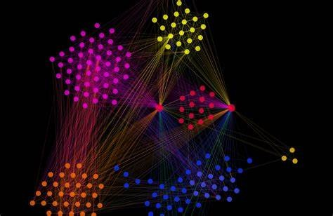
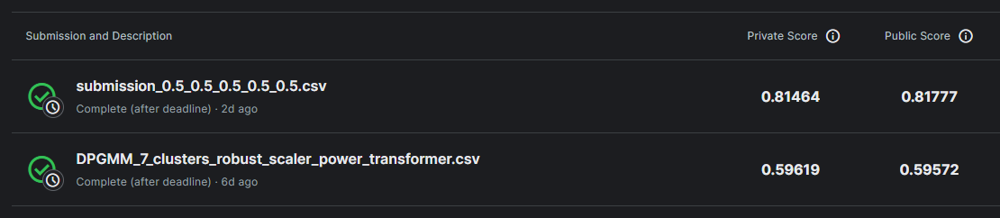

# Unsupervised Learning Clustering Challenge

## 1. Description
Welcome to Unsupervised Learning Clustering Challenge! This solution was crafted specifically for participation in Kaggle's competition. In this challenge, participants were given a dataset where each row belongs to a particular cluster. The task was to predict the cluster each row belongs to without any prior training data or knowledge of the number of clusters in the ground truth labels.

## 2. Dataset Description
For this challenge, participants were provided with (simulated) manufacturing control data that can be clustered into different control states. The objective was to cluster the data into these control states without any training data or prior knowledge of the number of possible control states. This simulates a real-world scenario of unsupervised clustering.

## 3. Evaluation
Submissions were evaluated on the Adjusted Rand Index between the ground truth cluster labels of the data and the predicted cluster labels. As this is a completely unsupervised problem, no information regarding the number of ground truth clusters or any training labels was provided.

### 3.1 Evaluation Results
After submitting the files to the Kaggle competition and evaluating them based on the Adjusted Rand Index:

### 3.1.1. Unsupervised Clustering
- **Private Score:** 0.59619
- **Public Score:** 0.59572

### 3.1.2. Semi-Supervised Clustering
- **Private Score:** 0.81464
- **Public Score:** 0.81777

## 4. Project Structure
Unsupervised-Learning-Clustering-Algorithms-Implementation 
├── DataPreprocessing 
│ ├── DataPreprocessing.ipynb 
│ └── Notes.md 
├── Datasets 
│ ├── final 
│ ├── outputs 
│ ├── preprocessed_datasets 
│ ├── raw_datasets 
│ └── submissions_semisupervised 
├── EDA 
│ ├── EDA.ipynb 
│ └── Notes.md 
├── Modeling-SemiSupervised-Clustering 
│ ├── Modeling-SemiSupervised-Clustering.ipynb 
│ └── Notes.md 
├── Modeling-UnSupervised-Clustering 
│ ├── Modeling-UnSupervised-Clustering.ipynb 
│ └── Notes.md 
├── LICENSE 
└── README.md 

## 5. Exploratory Data Analysis (EDA)
File: [`EDA.ipynb`](EDA/EDA.ipynb)

### 5.1. Description:
This notebook conducts exploratory data analysis on the manufacturing control dataset. It covers preliminary data exploration, distribution analysis of discrete and continuous features, KDE plots, correlation analysis, hypothesis testing for normality and Poisson distribution, and Q-Q plot analysis.

### 5.2. Findings:
- Continuous features exhibit adherence to normal distribution patterns.
- Discrete features exhibit resemblances to a Poisson distribution.

### 5.3. Future Plan of Action:
- Transform and standardize data
- Determine optimal number of clusters
- Feature selection
- Modelling
- Cluster quality analysis

## 6. Data Preprocessing
File: [`DataPreprocessing.ipynb`](DataPreprocessing/DataPreprocessing.ipynb)

### 6.1. Description:
This code performs several tasks related to data preprocessing, clustering, and feature selection.

### 6.2. Steps:
1. Importing Libraries and Data
2. Separating Data based on Data Types and Distributions
3. Data Transformation
4. Determining the Number of Clusters
5. Saving Various Cluster Number Scores
6. Feature Selection
7. Fitting GMM and Visualizing Cluster Means

## 7. Modeling - Unsupervised Clustering
File: [`Modeling-UnSupervised-Clustering.ipynb`](Modeling-UnSupervised-Clustering/Modeling-UnSupervised-Clustering.ipynb)

### 7.1. Description:
This code focuses on clustering the data using Gaussian Mixture Models (GMM) and Bayesian Gaussian Mixture Models (BGMM).

### 7.2. Steps:
1. Importing Libraries and Data
2. Transforming Data
3. Defining the Number of Clusters and Output Path
4. Defining Various Functions for Clustering
5. Training the Clustering Algorithms and Saving the Outputs for Submission
6. Print Results

## 8. Modeling - Semi-Supervised Clustering
File: [`Modeling-SemiSupervised-Clustering.ipynb`](Modeling-SemiSupervised-Clustering/Modeling-SemiSupervised-Clustering.ipynb)

### 8.1. Description:
This code implements semi-supervised clustering and classification using various models and techniques.

### 8.2. Steps:
1. Importing Libraries and Data
2. Transforming Data
3. Defining the Number of Clusters
4. Defining Various Functions for Semi-Supervised Clustering
5. Defining Various Classification Models for Semi-Supervised Learning
6. Training the Semi-Supervised Clustering Algorithms and Saving the Outputs for Submission

These results indicate a significant improvement in performance when employing semi-supervised learning compared to unsupervised learning alone.

## 9. License
This project is licensed under the [MIT License](LICENSE).